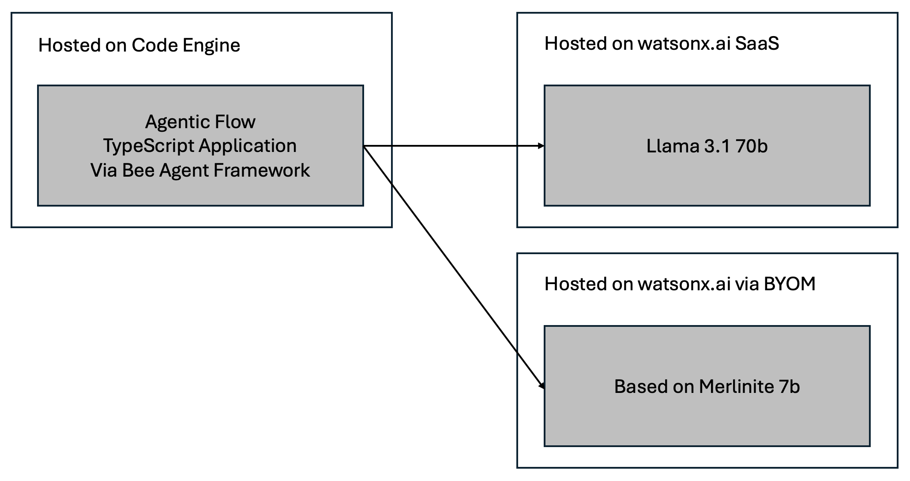
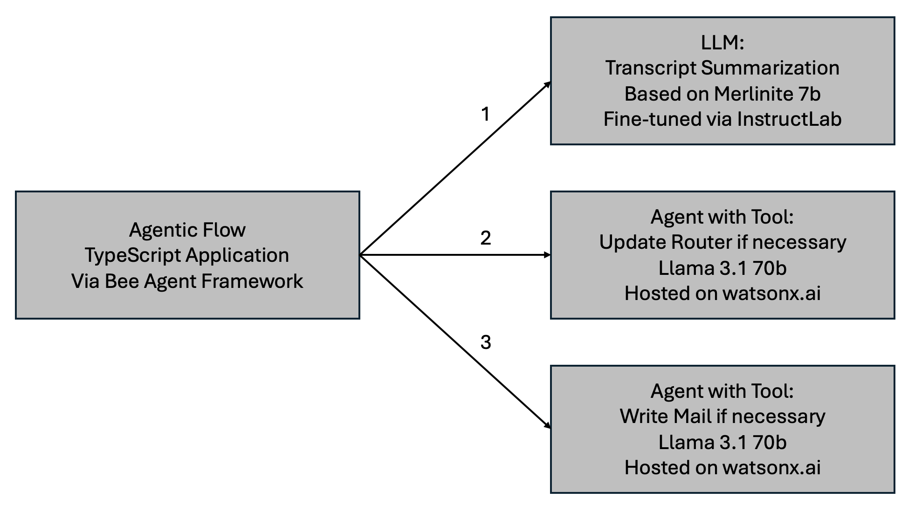

# watsonx Demos: watsonx.ai, InstructLab, Bee, watsonx.governance, watsonx Orchestrate

This repo contains demonstrations of [IBM watsonx](https://www.ibm.com/watsonx), an AI and data platform built for business.

The example AI application in this repo leverages the following main components:

* [IBM watsonx.ai](https://www.ibm.com/products/watsonx-ai)
* [IBM watsonx.governance](https://www.ibm.com/products/watsonx-governance)
* [IBM watsonx Orchestrate](https://www.ibm.com/products/watsonx-orchestrate)
* [InstructLab](https://github.com/instructlab/instructlab)
* [Bee Agent Framework](https://github.com/i-am-bee/bee-agent-framework)

Additionally, the application utilizes various tools:

* [IBM Cloud Code Engine](https://www.ibm.com/products/code-engine)
* [Ollama](https://ollama.com/)
* [Podman Desktop](https://podman-desktop.io/)
* TypeScript, Node, Yarn, etc.

## Technical Highlights

* Invocations of watsonx.ai LLMs from TypeScript applications via the Bee Agent Framework
* Patterns how to chain and orchestrate agents with tools
* Fine-tuning of a transcript summarization model via InstructLab for faster response times and cheaper operations
* Invocations of local fine-tuned models in Bee applications via Ollama
* Deployment of the fine-tuned model to watsonx.ai SaaS
* Deployment of the TypeScript application with REST endpoints to Code Engine
* Governance of the summarization model via generic GenAI metrics and custom metrics
* Integrations of custom agent applications in watsonx Orchestrate

The application can be run locally or on the IBM Cloud. The models can be hosted locally or on watsonx.ai.

<kbd></kbd>

See the [documentation](documentation/Architecture.md) for more details about the architecture.

## Agentic Flows

The flows in the sample scenario have three steps:

1. Summarize transcript
2. Update router if necessary
3. Write mail if necessary

<kbd></kbd>

There are three different flows which implement the same scenario.

1. One (remote) LLM (Llama) and two agents (Llama) with one tool each - see [flow](documentation/Flow-OneLLMTwoAgents.md)
2. One (remote) LLM (Llama) and one agent (Llama) with two tools - see [flow](documentation/Flow-OneLLMOneAgent.md)
3. One fine-tuned (local) LLM (Llama) and two agents (Llama) with one tool each - see [flow](documentation/Flow-OneFineTunedLocalLLMTwoAgents.md)

## Documentation

* [Bee Application](application/README.md)
* [Architecture](documentation/Architecture.md)
* [InstructLab Fine Tuning](instructlab/README.md)
* [Governance](governance/README.md)
* [Deploying Foundation Models on watsonx.ai](https://heidloff.net/article/deploying-custom-foundation-models-watsonx-ai/)
* [GenAI Quality Metrics for third Party Models in watsonx](https://heidloff.net/article/generative-ai-quality-metrics-watsonx-governance-third-party-models/)
* [watsonx Orchestrate Sreenshots](documentation/Orchestrate.md)

## Scenario

The example AI application handles a typical customer care scenario.

* A transcript of a call between a (human) agent of a telecommunication company and a client is provided as input which a Speech to Text service had created earlier.
* The client has issues with the router which requires a router software update.
* The AI application detects that a router update is needed which is done automatically.
* After a successful update a mail is sent to the client with an update and the summary of the call.

The application is a workflow with three steps:

1. Summarization of the transcript via a LLM
2. Invocation of a tool to update the router if an agent determines that it's necessary
3. Invocation of a tool to write a mail if an agent determines that the update has been successful

## Get started

```bash
git clone https://github.com/nheidloff/watsonx-demos
cd watsonx-demos/application
cp .env.template .env
# define WATSONX_API_KEY and WATSONX_PROJECT_ID
yarn install
yarn start:appOneLLMTwoAgents
```

See the [application documentation](application/README.md) for more.

## Authors

The demonstrations of this repo have been implemented by the IBM DACH CSM team in corporation with tech sales.

* Niklas Heidloff
* Maximilian Jesch
* Ivan Iliash
* Niklas Kopp
* Alexander Seelert