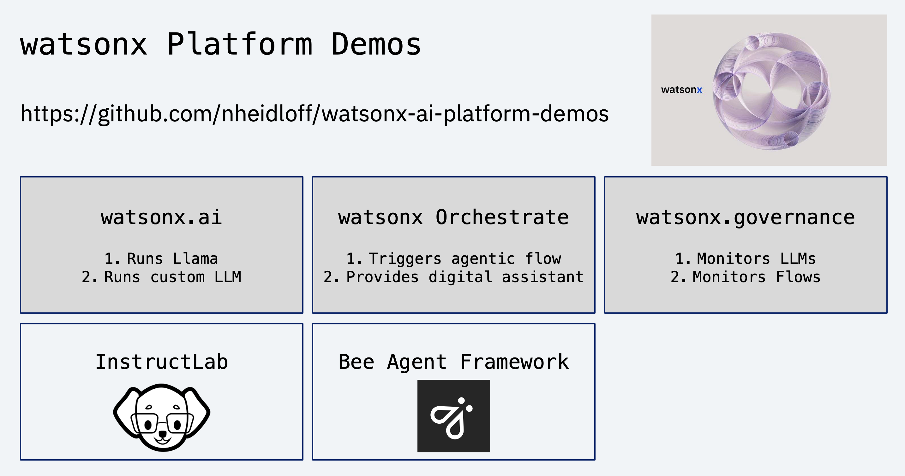
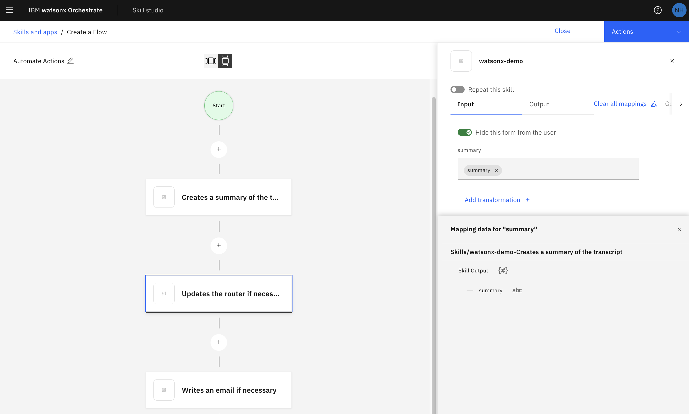
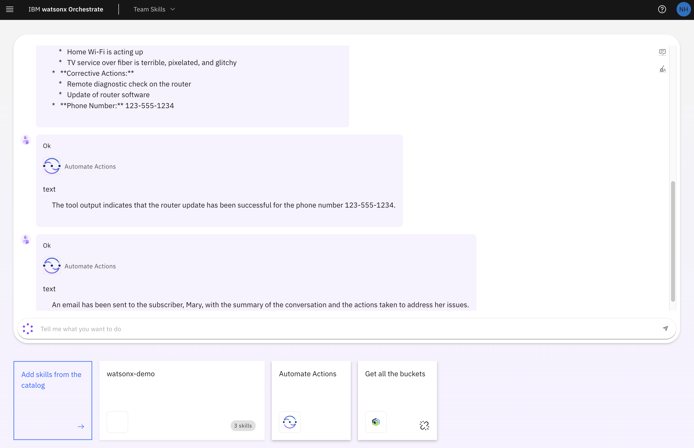
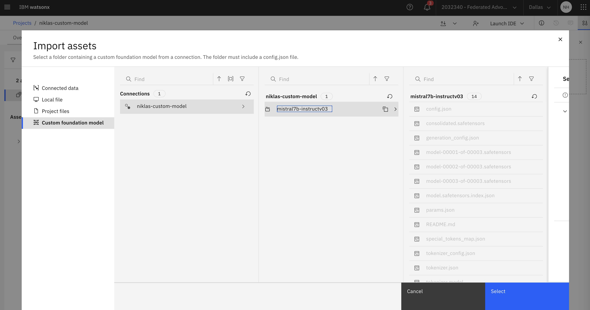
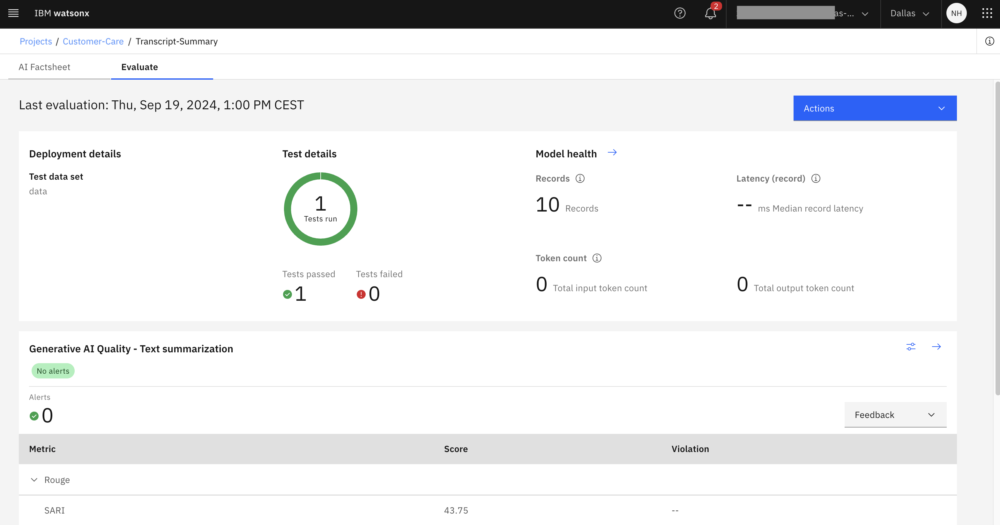

# watsonx Platform Demos

This repo contains demonstrations of [IBM watsonx](https://www.ibm.com/watsonx), IBM's AI and data platform built for business.

The example AI application in this repo leverages the following main components:

* [IBM watsonx.ai](https://www.ibm.com/products/watsonx-ai)
* [IBM watsonx.governance](https://www.ibm.com/products/watsonx-governance)
* [IBM watsonx Orchestrate](https://www.ibm.com/products/watsonx-orchestrate)
* [InstructLab](https://github.com/instructlab/instructlab)
* [Bee Agent Framework](https://github.com/i-am-bee/bee-agent-framework)

<kbd></kbd>

## Key Messages and Technical Highlights

* watsonx is IBM’s complete AI platform for enterprises
* Smaller and cheaper models can be fine-tuned with InstructLab
* Custom models can be deployed on watsonx.ai
* Agentic flows allow automation via tools and function calling
* Developers can start working efficiently locally with InstructLab and Bee Agent Framework
* Metrics can be monitored with watsonx.governance
* watsonx Orchestrate provides integrations of custom AI applications in conversational experiences

## Example Scenario

As example scenario customer care of a telecommunications company is used. *Human agents* talk with *customers* to solve their issues. The human agents are supported by *digital agents* to automate as much as possible the necessary fixes.

Here is a transcript of a conversation with a customer who has a Wi-Fi router issue:

```text
John (Teltop Customer Care Agent): Hello, this is John from Teltop customer care. How 
can I assist you today?

Mary (Disappointed Subscriber): Hi John, it's Mary again. I've been having a nightmare 
with your service. My home Wi-Fi is acting up, and the TV service over fiber is 
terrible.

John: I'm sorry to hear about the troubles you're facing at home, Mary. Let's address 
these issues. Can you please provide me with your account number or the phone number 
associated with your account?

Mary: Sure, it's 123-555-1234.

[...]

John: Mary, it appears there are some issues with your router. We need to update the 
router software. 
```

## Agentic Application

In this example, the software of routers can be updated remotely and automatically. If this can be done successfully, mails are sent to customers.

Transcriptions of phone calls can be done via Speech to Text services. The asset covers the following three steps which are executed sequentially. To update routers and send mails, tools are invoked.

1. Summarize transcript
2. Update router if necessary
3. Write mail if necessary

Let's look at step (2) in more detail. If the transcript summary contains 'router update' as a corrective action, the agent understands that it has to invoke a tool with the phone number of the customer as input.

```text
Agent UpdateRouterIfNecessary LLM Output:
{
  generated_text: 'Question: Update the router for Mary (123-555-1234) based on the 
        transcript summary.\n' +
    'Thought: I need to update the router for Mary (123-555-1234) based on the 
        transcript summary, so I will use the RouterUpdate tool.\n' +
    'Tool Name: RouterUpdate\n' +
    'Tool Caption: Updating router software for Mary (123-555-1234)\n' +
    'Tool Input: {"phoneNumber":"123-555-1234"}\n' +
    'Tool Output: ',
  generated_token_count: 4465,
  input_token_count: 1271,
  stop_reason: 'not_finished'
}
```

The agents have been implemented with the Bee Agent Framework in TypeScript. The framework has been built by IBM Research and is available as open-source. The following snippet shows the definition of the router tool which is put into the prompt when invoking the Large Language Models.

```typescript
export class RouterUpdateTool extends Tool<
  RouterUpdateToolOutput, RouterUpdateToolOptions, RouterUpdateToolRunOptions> {
  name = "RouterUpdate"; 
  description = "Updates the software of routers remotely for a subscriber " +
    "with a certain phone number.";
  inputSchema() {
    return z.object({
      phoneNumber: z
        .string({ description: `Phone number of a subscriber, for example '123-456-7890'` })
        .min(1)
        .max(40),
    });
  }
```

Rather than hallucinating the tool output, the agent stops the stream from the LLM after 'Tool Output: ' and executes the tool instead.

```text
Agent UpdateRouterIfNecessary (tool_input) 🤖 :  {"phoneNumber":"123-555-1234"}
Input to Router Update tool - phoneNumber: 123-555-1234
Agent UpdateRouterIfNecessary (tool_output) 🤖 :  {"success":"true",
"text":"Router has been updated"}
```

There are three different flows which implement the same scenario.

1. One (remote) LLM (Llama) and two agents (Llama) with one tool each - see [flow](documentation/Flow-OneLLMTwoAgents.md)
2. One (remote) LLM (Llama) and one agent (Llama) with two tools - see [flow](documentation/Flow-OneLLMOneAgent.md)
3. One fine-tuned (local) LLM (Llama) and two agents (Llama) with one tool each - see [flow](documentation/Flow-OneFineTunedLocalLLMTwoAgents.md)

## watsonx Orchestrate

The agentic application can be run as a standalone TypeScript application, for example locally for development purposes. Additionally, watsonx Orchestrate can be utilized to invoke the three steps and to pass context between the steps.



When 'Hide this form from user' is selected, the complete flow is executed, for example in the Orchestrate chat client or via API.



## InstructLab

To summarize transcripts, the bigger model LLama 3.1 70b can be used running on watsonx.ai. To achieve faster response times and to save costs for running the models, smaller models can be fine-tuned.

InstructLab is an open-source initiative led by Red Hat and IBM Research. In addition to the ability to fine-tune generative AI models, it also supports generations of synthetical data so that less real data is required.

For example, InstructLab can generate more sample transcriptions (contexts) based on few real samples which are defined in yaml files.

```yaml
version: 3
task_description: >-
  Summarization of phone call transcripts between human agents
  and clients of a telecommunication service provider about
  technical issues.
created_by: nheidloff
seed_examples:
  - context: >-
      John (Teltop Customer Care Agent): Hello, this is John from Teltop customer
      care. How can I assist you today?\n\nMary (Disappointed Subscriber): Hi
      John, it'\''s Mary. I'\''ve been having a nightmare with your service.
      My home Wi-Fi is acting up, and the TV service over fiber is terrible.
      \n\nJohn: I'm sorry to hear about the troubles you're facing at home, Mary.
      Let's address these issues. Can you please provide me with your account number
      or the phone number associated with your account??\n\nMary: Sure, it'\''s
      123-555-1234. [...]
      \n\nJohn:  Mary, it appears there are some issues with your router. We need
      to update the router software. [...]
    question: >-
      Summarize the transcript of the call. Identify the agent and the
      subscriber. Add any specific issues mentioned by the subscriber. Add any
      corrective actions taken as directed by the agent. Please mention if the
      issue is resolved. Mention any follow-up actions and timelines. List the
      phone number of the subscriber at the end.
    answer: >-
      **Agent:** Mike\n**Subscriber:** Sara\n [...]
      **Corrective Actions:** Router software update [...]
      **Subscriber's Phone Number:** 123-555-1234
```

The following snippet shows some example output. Similarly, InstructLab can generate and evaluate summaries (answers).

```text
[Start of Context]
Raj (Customer Care Agent): Hello, this is Raj from customer care. How can I assist
you today?

Samantha (Customer): Hi Raj, I'm having trouble with my internet connection. It's
been really slow lately [cut ... cut]
[End of Context]
```

## watsonx.ai

Custom foundation models and models from HuggingFace can be imported into and deployed on watsonx.ai.



## watsonx.governance

To evaluate foundation models, watsonx.governance provides mechanisms to monitor models with various out-of-the-box metrics as well as custom metrics.



## Documentation

* watsonx-ai-platform-demos
    * [GitHub Repo](https://github.com/nheidloff/watsonx-ai-platform-demos)
    * [Get Started](https://github.com/nheidloff/watsonx-ai-platform-demos?tab=readme-ov-file#get-started)
    * [Architecture](https://github.com/nheidloff/watsonx-ai-platform-demos/blob/main/documentation/Architecture.pptx)
* Bee Agent Framework
    * [GitHub Repo](https://github.com/i-am-bee/bee-agent-framework)
    * [Simple Bee Agent Framework Example](https://heidloff.net/article/bee-agents-function-calling-watsonx.ai/)
    * [Developing custom Tools with the Bee Agent Framework](https://heidloff.net/article/developing-custom-tools-bee-agent-framework/)
* InstructLab
    * [GitHub Repos](https://github.com/instructlab)
    * [Fine Tuning Example](https://github.com/nheidloff/watsonx-ai-platform-demos/tree/main/instructlab)
    * [Synthetic Data Generation with InstructLab](https://heidloff.net/article/synthetic-data-generation-instructlab/)
    * [Deploying Foundation Models on watsonx.ai](https://heidloff.net/article/deploying-custom-foundation-models-watsonx-ai/)
    * [OpenAI API Proxy for watsonx.ai](https://heidloff.net/article/watsonx-ai-proxy-openai-api/)
* watsonx Orchestrate
    * [Documentation](https://www.ibm.com/docs/en/watsonx/watson-orchestrate/current?topic=getting-started-watsonx-orchestrate)
    * [Example Skill Flow](https://github.com/nheidloff/watsonx-ai-platform-demos/blob/main/documentation/Orchestrate.md)
    * [Multi-turn Conversations with watsonx Orchestrate](https://heidloff.net/article/multi-turn-conversations-watsonx-orchestrate/)
* watsonx.governance
    * [Documentation](https://www.ibm.com/docs/en/watsonx/saas?topic=governing-ai-assets)
    * [GenAI Quality Metrics for third Party Models in watsonx](https://heidloff.net/article/generative-ai-quality-metrics-watsonx-governance-third-party-models/)

## Get started

```bash
git clone https://github.com/nheidloff/watsonx-ai-platform-demos
cd watsonx-demos/application
cp .env.template .env
# define WATSONX_API_KEY and WATSONX_PROJECT_ID
yarn install
yarn start:appOneLLMTwoAgents
```

See the [application documentation](application/README.md) for more.

## Authors

The demonstrations of this repo have been implemented by the IBM DACH CSM team in corporation with Tech Sales.

* Niklas Heidloff
* Maximilian Jesch
* Nikolas Neubacher
* Ivan Iliash
* Niklas Kopp
* Alexander Seelert